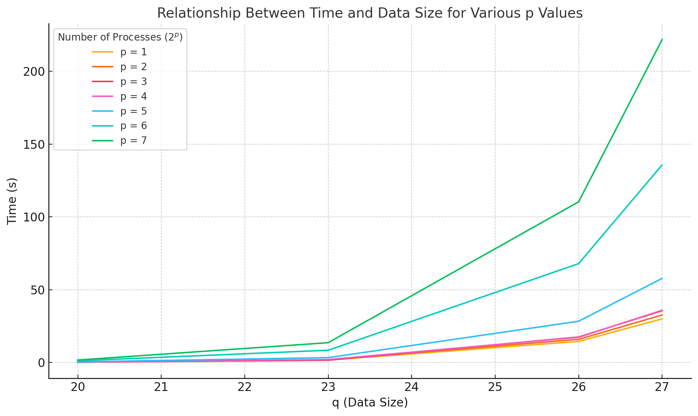
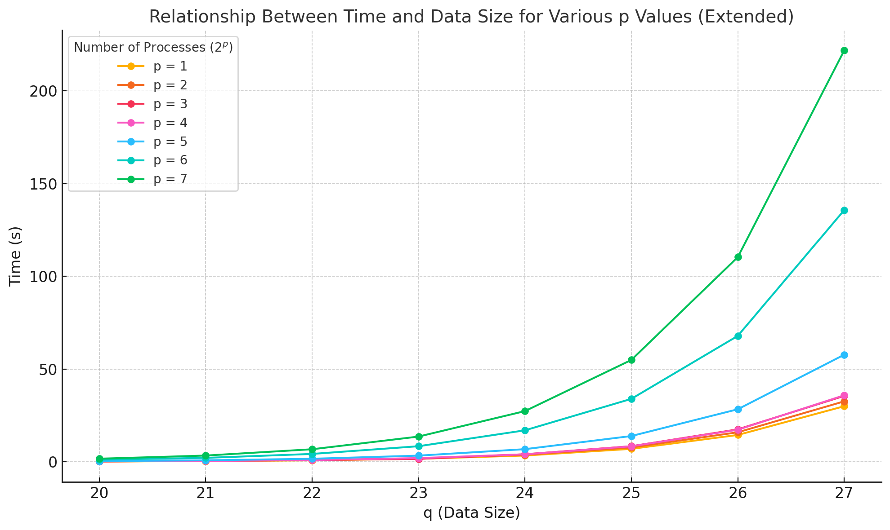

## Sorting Time Report

Running our implementation for $q = [20, 23, 26, 27]$ and $p = [1:7]$, we present our results in the following table (complete sorting time in `msec`):

| $q$    | $p = 1$     | $p = 2$     | $p = 3$     | $p = 4$     | $p = 5$     | $p = 6$     | $p = 7$     |
|--------|-------------|-------------|-------------|-------------|-------------|-------------|-------------|
| 20     | 180.28      | 201.03      | 180.99      | 247.14      | 400.50      | 1155.64     | 1675.08     |
| 23     | 1620.05     | 1786.39     | 1567.64     | 2003.65     | 3328.73     | 8398.28     | 13594.65    |
| 26     | 14463.13    | 15906.94    | 17490.90    | 17277.64    | 28320.93    | 67876.12    | 110331.75   |
| 27     | 29962.49    | 32584.55    | 35522.46    | 35850.10    | 57720.94    | 135654.06   | 221723.30   |

> **Note:** 
> The time measurements presented here are based on the current traffic of the *Aristotelis HPC system* at the time our tests were conducted. This traffic can influence the overall sorting time by affecting the communication speed (making it faster or slower). Results may vary under different network conditions.

When running this implementation, we adjust the `CHUNK_DIVISOR` parameter in the $\texttt{src/bitonic-sort.c}$ file. *Fine-tuning this variable based on the current network traffic may lead to better results.* Adjusting this parameter based on the scale of the problem will also influence the resulting sorting time. During testing across various test cases, we maintain this variable at a constant value to ensure better validation and facilitate comparison of the final results.

> Tip: To ***print each steps traffic logs***, enable the `PRINT_TIME_LOGS` option in the $\texttt{src/bitonic-sort.c}$ file.

---

Based on the above table, the following plot illustrates the relationship between time and data size for the various $p$ values ($2^p$ num of processes):

Looking at these results, it is easy to observe an exponential increase in sorting time as we increase the number $q$. However, considering that $q$ actually represents $2^q$ elements (locally to each process), we conclude that the hypothesis - that the sorting time is $2^q \times q$ ( it is $n \log n$ and represents the serial local initial sort) ***plus*** the additional $p^2 \times \texttt{communication time}$ - holds true. The adjustment we see in the additional factor is because of the *larger commutation time* when the local data increases with $q$.

To further support this hypothesis, we also conducted tests with values of $q = [21, 22, 24, 25]$ and $p = [1:7]$. The complete results are presented in the following table in `msec`:

| $q$    | $p = 1$       | $p = 2$       | $p = 3$       | $p = 4$       | $p = 5$       | $p = 6$       | $p = 7$       |
|--------|---------------|---------------|---------------|---------------|---------------|---------------|---------------|
| 20     | 180.28        | 201.03        | 180.99        | 247.14        | 400.50        | 1155.64       | 1675.08       |
| 21     | 378.57        | 436.31        | 468.50        | 454.16        | 804.21        | 2121.75       | 3366.25       |
| 22     | 784.42        | 895.40        | 964.17        | 940.60        | 1639.45       | 4242.84       | 6764.83       |
| 23     | 1620.05       | 1786.39       | 1567.64       | 2003.65       | 3328.73       | 8398.28       | 13594.65      |
| 24     | 3367.96       | 3771.06       | 4083.58       | 4034.50       | 6813.33       | 16966.12      | 27319.88      |
| 25     | 6978.72       | 7739.04       | 8404.00       | 8355.70       | 13889.58      | 33926.97      | 54902.19      |
| 26     | 14463.13      | 15906.94      | 17490.90      | 17277.64      | 28320.93      | 67876.12      | 110331.75     |
| 27     | 29962.49      | 32584.55      | 35522.46      | 35850.10      | 57720.94      | 135654.06     | 221723.30     |

And here is the plot:

